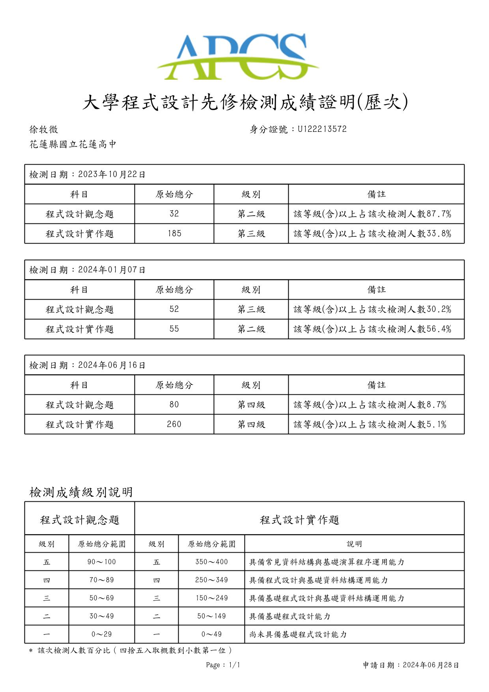

# 高中紀錄

## 競賽紀錄

- ### **APCS大學程式設計先修檢測**
  
  - 全國 | 個人 | 2024/06/16
  - 最高觀念四級分、實作四級分
  - 文件: 

- ### **2024年國家科學及技術委員會 GenAl Stars生成式AI百工百業應用選拔**
  
  - 全國 | 團體 | 2024/10
  - 特優
  - 文件(特優): 
  - 文件(入圍複審): 

---

- ### **CPE大學程式能力檢定**
  
  - CPE大學程式能力檢定 | 2024/10/15
  - 解題數: 2題
  - 文件: 

- ### **YTP少年圖靈計畫-程式挑戰營**
  
  - YTP少年圖靈計畫-程式挑戰營 | 2024/8/3
  - 參與證明
  - 文件: 

- ### **第十屆國立成功大學暑期高中生程式設計邀請賽-初賽**
  
  - 全國 | 團體 | 2024/4/14
  - 參與證明
  - 文件: 

- ### **2024 FUN AI WINTER CAMP**
  
  - 全國 | 個人 | 2024/02/04
  - 表現特優
  - 文件: 

- ### **USACO**
  
  - 國際 | 個人 | 2024/01/17
  - 銅牌 | 1000 (rank 1)
  - 文件: 

- ### **高中生AI扎根系列活動**
  
  - 全國 | 團體 | 2023/08/26
  
  - 第一名優勝團隊「表現傑出獎」
  
  - 文件: 
  
  - 全國 | 團體 | 2023/08/09
  
  - 綜合表現獎
  
  - 文件: 

- ### **112學年度數理及資訊學科能力競賽初賽**
  
  - 校級 | 個人 | 2023/10/02
  - 佳作
  - 文件: 

## 活動、研習參與紀錄

- ### **國立師範大學資訊工程學系「APCS C/C++程式設計課程」**
  
  - APCS C/C++程式設計課程
  - 2024/7/6 | 參與證明
  - 文件: 

- ### **2024跨域AI玩轉環境大數據三日營**
  
  - 2024跨域AI玩轉環境大數據三日營:臺東場
  - 2024/7/6 | 參與證明
  - 文件: 

- ### **2024高中海狸一日營**
  
  - 2024高中海狸一日營
  - 2024/7/1 | 參與證明
  - 文件: 

- ### **教育部先進資通安全實務人才培育計畫**
  
  - #### 「臺灣尚青TAIWAN HolyYoung Training」-網站安全
  - 2024/5/18 | 學習證書 6小時
  - 文件: 

  - #### 高中職學生資安體驗營 Happy CyberSecurity Day
  
  - 2023/7/8 | 學習證書 2小時
  - 文件: 

  - #### 資安深耕研習營 Advanced CyberSecurity Day：Happy Linux Day-Linux與基礎資安分析實務
  
  - 2023/7/8 | 學習證書 4小時
  - 文件: 

  - #### 資安深耕研習營 Advanced CyberSecurity Day：Happy Python Day-Python與基礎資安分析實務
  - 2023/7/9 | 學習證書 5小時
  - 文件: 

# 國中紀錄

## 國中競賽紀錄

  - ### 2021 IEYI 世界青少年創客發明展暨台灣選拔賽（全國）
  - 全國 | 團體 | 2021/4/18
  - 銀牌獎
  - 文件: 

  - ### 109學年度科技教育創意實作競賽 生活科技組-國中組
  - 花蓮縣 | 團體 | 2020/12/12
  - 生活科技組-國中組銅獎
  - 文件: 

  - ### 2020太平洋盃仿生機器人創作競賽 六足機器人競速賽
  - 花蓮縣 | 個人 | 2020/9/19
  - 佳作
  - 文件: 

## 國中活動研習參與紀錄

  - ### 花蓮高中第32屆科學傳承營
  - 2022/8/9~12 | 研習時數 32小時
  - 文件: 

  - ### 擔任國際女性科學日活動解說服務志工
  - 2021/2/6~7 | 服務時數 9小時
  - 文件: 

  - ### 擔任花蓮縣科學闖關活動解說服務志工
  - 2020/12/27 | 服務時數 4小時
  - 文件: 
